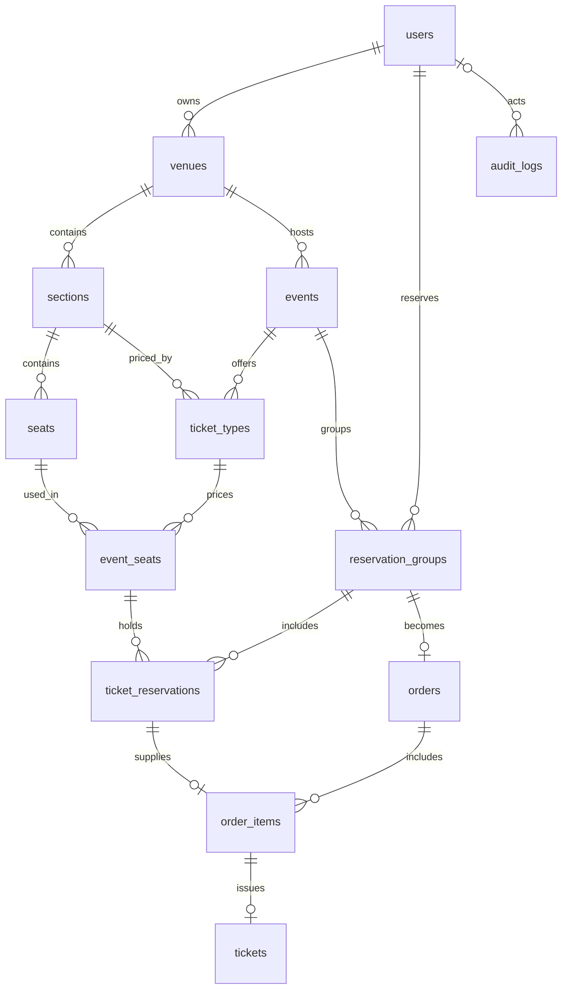

# Схема БД TicketFlow

Этап 2: 13 таблиц SQLAlchemy, миграция Alembic `0001` и повторяемый seed.
Исходное [ТЗ](spec.md) сохранено; уточнения схемы реализуют [план](plan.md).

## Таблицы

| Таблица | Что хранит |
| --- | --- |
| `users` | Email, хеш пароля, роль; email уникален без учёта регистра |
| `venues` | Площадка, город, положительная вместимость и организатор |
| `sections` | Секции с уникальным названием внутри площадки |
| `seats` | Ряд и номер места, уникальные внутри секции |
| `events` | Событие, дата, категория, статус и владелец площадки |
| `ticket_types` | Тариф события для секции той же площадки |
| `event_seats` | Инвентарь события: первичный ключ `(event_id, seat_id)`, секция и тариф |
| `reservation_groups` | Общие владелец, событие и срок брони нескольких мест |
| `ticket_reservations` | Строки брони с полями ТЗ и ссылкой на группу |
| `orders` | Один заказ на группу брони, владелец, событие, сумма и статус |
| `order_items` | Забронированные места заказа, снимок цены и названия тарифа |
| `tickets` | Ссылка на позицию заказа, событие, место, уникальный QR UUID и статус |
| `audit_logs` | Действие, сущность, пользователь или системное действие, время и IP |



## Принятые решения

| Область | Правило |
| --- | --- |
| Идентификаторы | UUID генерируются PostgreSQL; у `event_seats` составной ключ |
| Даты | `TIMESTAMP WITH TIME ZONE`; приложение передаёт даты с часовым поясом |
| Деньги | `NUMERIC(12,2)`, Python `Decimal`, диапазон 0–9 999 999 999,99; отрицательные суммы и `NaN` запрещены |
| Валюта | Только `KZT`, проверяется БД |
| Категории | `concert`, `cinema`, `conference`, `football`, `stand_up`, `other` |
| Статусы | Значения исходного ТЗ; `VARCHAR` с именованными CHECK-ограничениями |
| Связи | Составные FK исключают чужую площадку, секцию, тариф, группу и позицию заказа |
| Срок группы | По умолчанию 10 минут после создания; общий `expires_at` и владелец дублируются в строках брони под контролем составного FK |
| История | Каскадное удаление бизнес-данных не настроено; существующие ссылки блокируют удаление |
| Тарифы | Допускаются несколько тарифов секции; у места события выбран один тариф |
| Аудит | `user_id` допускает NULL для системных действий; `entity_id` — UUID без полиморфного FK, IP — PostgreSQL INET |

Составные уникальные ключи с `id` служат целями внешних ключей: они обеспечивают
совпадение владельца, события и места, даже если запись существует с другим контекстом.

## Защита мест

| Ограничение | Что гарантирует |
| --- | --- |
| PK `event_seats(event_id, seat_id)` | Одна строка инвентаря, которую можно заблокировать перед бронированием |
| Уникальный индекс брони при `status = 'ACTIVE'` | Не более одной активной строки брони для события и места |
| Уникальный индекс билетов при `status IN ('VALID', 'USED')` | Не более одного действующего или использованного билета для события и места |
| Уникальные `reservation_group_id`, `reservation_id`, `order_item_id`, `qr_code` | Нет повторного заказа группы, повторной позиции брони, повторного билета позиции и повторного QR |

Частичные индексы не проверяют текущее время. Этап 5 должен под блокировкой
`event_seats` переводить просроченную бронь в `EXPIRED`, проверять существующий
билет и резервировать все запрошенные места одной транзакцией.
Смена статуса на `CANCELLED` освобождает уникальность билета; возможность перепродажи
дополнительно определяется статусом события и политикой отмены.

Между таблицами брони и билетов нет общего уникального индекса: согласование
бронирования с продажей требует транзакций следующих этапов. Проверка ролей,
вместимости относительно количества мест, суммы заказа относительно позиций,
оплаты перед выпуском билета и допустимости переходов статусов также относится
к сервисной логике этапов 3–8.

## Миграции и seed

```sh
uv run --locked alembic upgrade head
uv run --locked alembic current
uv run --locked alembic check
uv run --locked python -m ticketflow.seed
```

Подключение берётся из `DATABASE_URL`, реквизиты в `alembic.ini` не записываются.
Миграции запускаются отдельно от старта API. Новое изменение модели оформляется
новой миграцией: `uv run alembic revision --autogenerate -m "описание"`.
Сгенерированный файл нужно проверить и отформатировать; опубликованную миграцию
не переписывают. Alembic check дополняется тестами ограничений, поскольку
автогенерация не обнаруживает все изменения CHECK-условий.

Seed для разработки создаёт 3 пользователя, площадку в Алматы, 2 секции,
12 мест, 2 события, 4 тарифа и 24 строки инвентаря. Даты новых событий — через
30 и 31 день; повторный запуск сохраняет существующие даты и остальные значения.
Учётные записи `*@demo.ticketflow.invalid` имеют отключённый пароль `!` и не
предназначены для входа. Покупки seed не создаёт. Вывод команды — количество
добавленных строк по таблицам; при повторе — нули. Все вставки атомарны.

## Проверки

`uv run --locked --env-file .env pytest` запускает проверки на PostgreSQL.
Каждый тест схемы создаёт отдельную `test_ticketflow_<uuid>` в `TEST_DATABASE_URL`
и удаляет только её после выполнения. Учётной записи нужны права CREATE SCHEMA.
Миграции проверяются через upgrade → downgrade → upgrade и сравнение с моделями;
таблицы приложения в `public` не очищаются. Не направляй тесты на production.

Документация: [Alembic autogenerate](https://alembic.sqlalchemy.org/en/latest/autogenerate.html),
[PostgreSQL constraints](https://www.postgresql.org/docs/current/ddl-constraints.html),
[partial indexes](https://www.postgresql.org/docs/current/indexes-partial.html).
